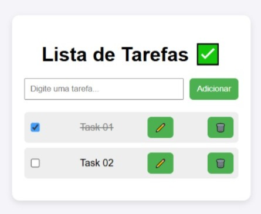

# To-Do App (Vanilla JS)

> A simple and interactive To-Do App built with HTML, CSS, and JavaScript. Users can add, edit, delete, and mark tasks as completed. All tasks are saved in localStorage for persistence. No frameworks used.

---

## 🚀 Features

- Add new tasks
- Edit existing tasks
- Delete tasks
- Mark tasks as completed
- Tasks are saved in **localStorage** to persist after page reload
- Fully front-end, **no frameworks or libraries required**

---

## 🛠️ Technologies

- HTML5
- CSS3
- JavaScript (Vanilla JS)
- LocalStorage API

---

## 🎨 Screenshot

 

---

## ⚡ How to Run

1. Clone the repository:  
   ```bash
   git clone https://github.com/EmillyAndradeDev/todo-app-vanilla-js.git
   ```
2. Open index.html in your browser.

3. Start adding, editing, deleting, and completing tasks.

---

### 📂 Folder Structure

```
to-do-app/
├─ index.html
├─ style.css
├─ script.js
└─ README.md
```

---

### 💡 Notes

- Ideal project to practice DOM manipulation and localStorage.
- Lightweight and easy to extend with new features.
- Perfect for showcasing in a front-end developer portfolio.

___

### 📝 License

This project is open-source and free to use.

